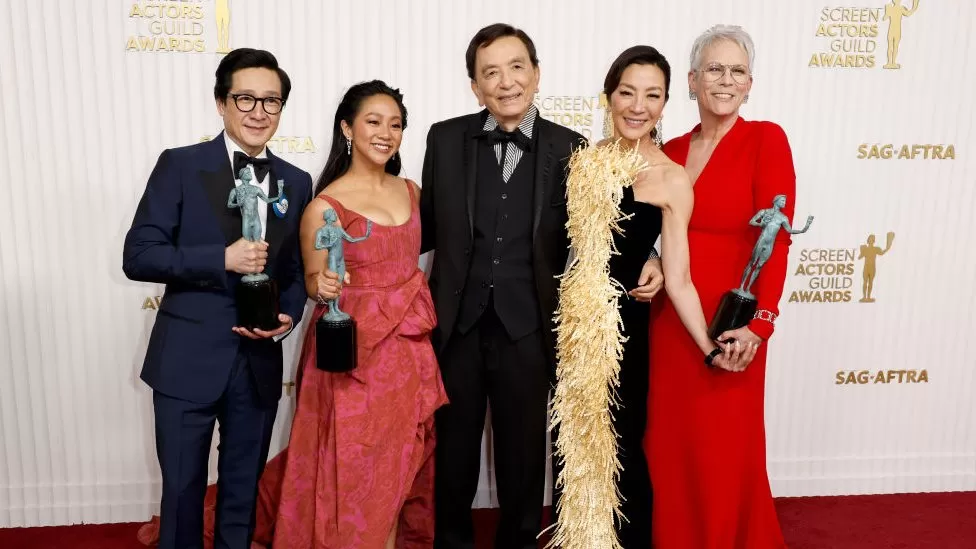

DorothyHAN_Programming_Homework (week 10)  

# How \#OscarsSoWhite changed the Academy Awards  
***By Sophie Long:pencil:***

> The film Everything Everywhere All at Once - with 11 Oscar nominations - has been praised for its diverse cast and unique depiction of the Asian-American experience

**The Academy of Motion Pictures remains overwhelmingly male and white - but there has been some change since #OscarsSoWhite started trending eight years ago. The BBC speaks to some Hollywood insiders and this year's Oscar nominees about the steps that have been taken - and the road still ahead.**  

With nominees like Everything Everywhere All at Once and Black Panther: Wakanda Forever, this year's Academy Awards will highlight the stellar work of diverse casts, directors and crews. But in 2015, the picture looked bleak.  

That is when the hashtag #OscarsSoWhite - started by activist and writer April Reign - began to trend, highlighting the fact that out of 20 actors nominated that year, none were people of colour.  

Recent research published by the Annenberg Inclusion Initiative, a think tank run out of the University of Southern California (USC), shows that in the eight years leading up to the #OscarsSoWhite protests, just 8% of Oscar nominees were people of colour.  

**Has the Oscars really faced up to its race problem?**  

But since then, there has been some change, says Dr Stacy L Smith, who led the research efforts at USC. In the eight years since the hashtag kicked off a firestorm, the number of nominees of colour has grown to 17%.  

"I think that there's cause for optimism, and some good news, which we don't often have when it comes to the entertainment industry," she told the BBC.  

<picture>
 <source media="(prefers-color-scheme: dark)" srcset="https://ichef.bbci.co.uk/news/976/cpsprodpb/8338/production/_128929533_gettyimages-1436968094.jpg.webp">
 
</picture>  

> Angela Bassett is nominated for her second Oscar for her role in Black Panther: Wakanda Forever  

*To read more please click [BBC News Pages :globe_with_meridians:](https://www.bbc.com/news/world-us-canada-64883399)*

## List of Asian Oscar Winners
|Award|Year|Name|Nationality|Born|Descent|
|:---|:---:|:---|:---|:---|:---|
|Best Actress|2022|Michelle Yeoh|Malaysia|Malaysia|China|
|Best Supporting Actor|1984|Haing S. Ngor|USA|Cambodia|China|
|Best Supporting Actor|2022|Ke Huy Quan|USA|Vietnam|China|
|Best Supporting Actress|1957|Miyoshi Umeki|USA|Japan|Japan|
|Best Supporting Actress|2020|Youn Yuh-jung|South Korea|North Korea|North Korea|
|Best Director|2005|Ang Lee|China|Taiwan|China|
|Best Director|2012|Ang Lee|China|Taiwan|China|
|Best Director|2019|Bong Joon-ho|South Korea|South Korea|South Korea|
|Best Director|2020|Chloé Zhao|China|China|China|
|Best Director|2022|Daniel Kwan|USA|USA|China|
  
### Related Resources  
- *List of Asian Academy Award winners and nominees [(Link)](https://en.wikipedia.org/wiki/List_of_Asian_Academy_Award_winners_and_nominees).*  
- *‘Everything Everywhere’ actor's SAG speech goes viral for making Hollywood contend with racist past [(Link)](https://www.nbcnews.com/news/asian-america/everything-everywhere-actors-sag-speech-goes-viral-making-hollywood-co-rcna72460).*
- *Oscars (Still) So White? 2023 Academy Awards Continue to Lack Representation [(Link)](https://news.wttw.com/2023/03/11/oscars-still-so-white-2023-academy-awards-continue-lack-representation).*  
